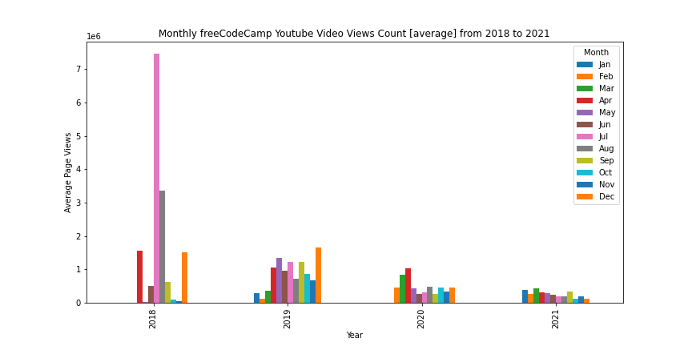
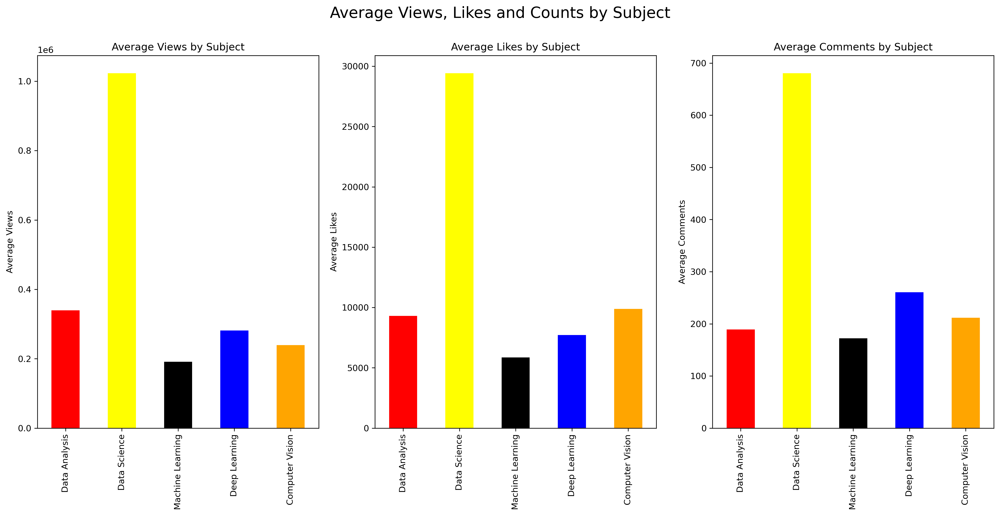

# Colecting Data from Youtube API

## Project Overview
- Working with real data using Youtube's API to collect video statistics from a channel (in this case from freeCodeCamp).
- Using the library requests to make the API calls and parsing the data through the JSON response.
- Storing and updating the data fetched into a PostgreSQL Database.
- Cleaning, filtering and visualizing the data. Access the full Python code **[here](https://github.com/ThiPauli/Fetch_Data_Youtube_API/blob/main/extracting_data_youtube_api_freecodecamp.ipynb)**.

## Objectives
* Create a data pipeline which fetch real data and upload into a database every time it makes a call. The metrics extracted were view, like and comment counts for each youtube video (with certain limitation) from freeCodeCamp channel. Since new videos will be updated and the old ones are still getting engaged with users, it returns the new videos data as well as the metrics updated for videos that already exist.
* With all this data, imagining if I were the channel owner, I could track and get some insights of how well my channel is performing, which videos are the most popular, when they were released, which subject/topics people are looking for, and so forth.

## Exploratory Data Analysis and Visualizations
After removing all videos released in 2017 (which were extracted only a few) and 2022:
* Exploration of the videos average views by month from 2018 to 2021.

Also, filtering the video titles which contain Python:
* What type of content is the most watched from freeCodeCamp YouTube channel when it envolves Python? Delimiting the subjects/topics as Data Analysis, Data Science, Machine Learning, Deep Learning and Computer Vision.

## Conclusions
* An issue which I faced was, although the freeCodeCamp youtube channel has 1424 videos, at some point it did not provide the nextPageToken, so it extracted only 420 records.
* The most popular videos released are from 2018, mainly the videos from July with more than 7 millions views. The recent videos (2021) are not as popular as the other ones, which may be people are not feeling interested in the content of those videos and/or opt to watch for another source.
* Regarding Python and considering only the subjects: Data Analysis, Data Science, Machine Learning, Deep Learning and Computer Vision, the most popular content from freeCodeCamp Youtube channel are videos with Data Science as a subject/topic in the title.
